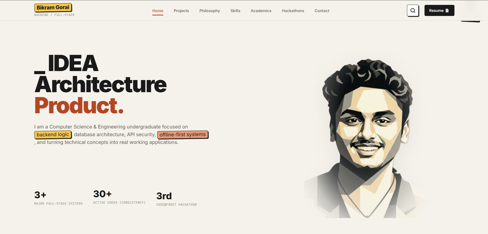
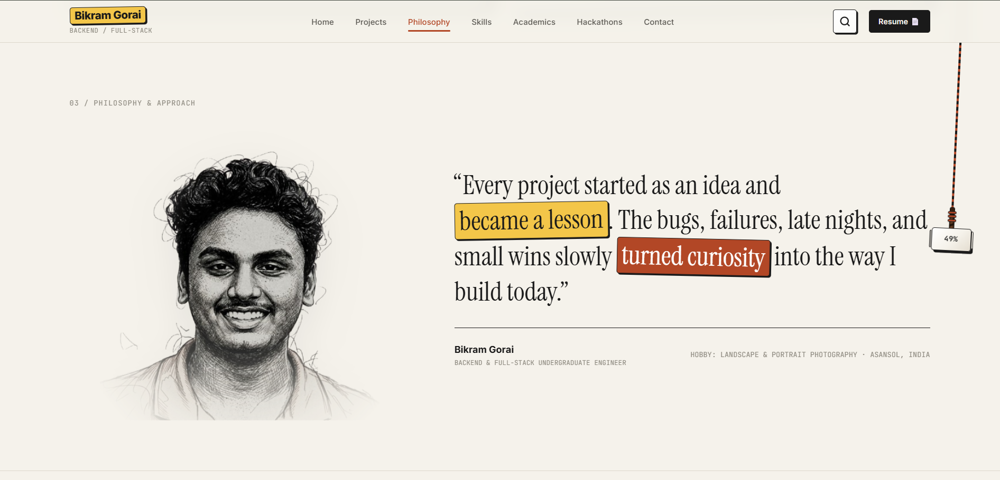
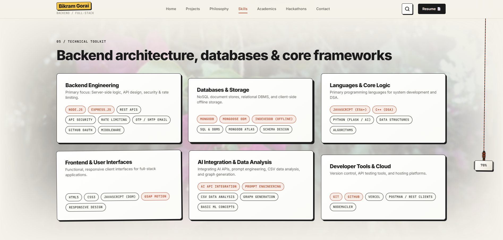
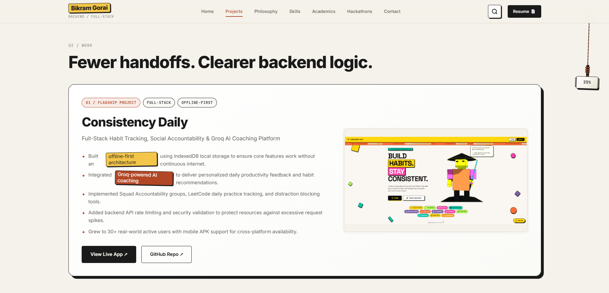
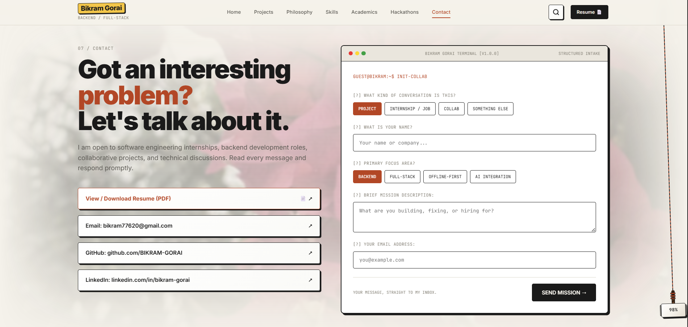

# Bikram Gorai — Engineering Portfolio 2.0 ⚡

> **Backend Architecture · Full-Stack Systems · Offline-First Applications**  
> A high-performance, engineering-focused personal portfolio featuring 3D Neo-Brutalist design, GSAP scroll triggers, custom interactive widgets, and real-time form dispatching.



---

## 🚀 Live Preview & Status

- **Live Deployment:** [bikramgorai.vercel.app](https://bikramgorai.vercel.app/) *(Vercel Live App)*
- **Custom Domain:** [bikramgorai.xyz](https://bikramgorai.xyz) *(Primary Domain)*
- **GitHub Repository:** [BIKRAM-GORAI/portfolio](https://github.com/BIKRAM-GORAI/portfolio)
- **Primary Stack:** HTML5, Modern CSS3 (Vanilla), JavaScript (ES6+), GSAP, ScrollTrigger, Formspree API

---

## ✨ Key Features & Interactive Architecture

### 1. 🔨 Desktop Thor's Hammer (Mjolnir) Scroll Widget
- **Pendulum Motion:** A fixed right-side 3D Mjolnir widget with a leather-wrapped handle tied to a hanging rope line. Sways gently in an organic side-to-side pendulum animation.
- **Dynamic Scroll Travel:** The rope lowers down the right edge of the viewport as the user scrolls, tracking scroll depth from **`0%`** at hero load to **`100%`** at the footer.
- **Recall to Top:** Clicking Mjolnir recalls the page back to the top (`window.scrollTo({ top: 0, behavior: "smooth" })`).

### 2. 📬 CLI Terminal Contact Form & Animated SVG Dispatch
- **Formspree Real Inbox Integration:** Submits inquiries directly to `https://formspree.io/f/mgawdaol` asynchronously via Formspree API.
- **Mailbox → Paper Airplane SVG Animation:** Triggers a custom `send-message.svg` animation overlay on submit, morphing a mailbox into a flying paper airplane while stepping through CLI status logs (`[1/3] PACKAGING MAILBOX...` → `[2/3] MORPHING TO AIRPLANE...` → `[3/3] MISSION DISPATCHED! ✓`).
- **Structured Email Payload:** Incoming emails arrive with a `Portfolio 2.0` subject header and full question-and-answer prompts.

### 3. 🔍 Command Palette Search Modal (`Ctrl` + `K`)
- **Instant Search:** Pressing <kbd>Ctrl</kbd>+<kbd>K</kbd> or <kbd>Cmd</kbd>+<kbd>K</kbd> opens a command palette to quickly filter projects, hackathon awards, technical skills, resume PDF, and contact links.
- **Full Keyboard Navigation:** Supports <kbd>↑</kbd> / <kbd>↓</kbd> arrow key navigation, <kbd>Enter</kbd> to select, and <kbd>Esc</kbd> or header badge button to close.

### 4. 🎨 Editorial Asymmetry & 3D Neo-Brutalist Aesthetics
- **Curated Palette:** Soft paper surfaces (`#F5F2EB`), warm terracotta wash (`#F8ECE7`), rich terracotta accents (`#B24726`), and deep charcoal text (`#1A1A1A`).
- **3D Elevation:** 1.5px solid dark borders with offset box shadows (`4px 4px 0px #1A1A1A`) across all card components.
- **Photography Feathering:** Integrated background photography (`bg1.png` under Skills, `bg4.png` under Contact) with multi-stage 4-side linear gradient mask dissolves.

---

## 🖼️ Portfolio Visual Showcase

### 01 / Live Snapshot & Now In Rotation


### 02 / Featured Engineering Projects


### 03 / Academics & Education Timeline


### 04 / Interactive CLI Terminal Intake Form


---

## 📁 Repository Structure

```
portfolio/
├── index.html            # Main single-page application structure
├── vercel.json           # Vercel deployment, url cleaning & header caching config
├── .gitignore            # Git exclusion rules
├── README.md             # Project documentation & visual showcase
├── css/
│   ├── main.css          # Design system tokens, root variables & base resets
│   ├── layout.css        # Section grids, editorial asymmetry & responsive queries
│   └── components.css    # 3D Neo-Brutalist cards, pills, modals & overlays
├── js/
│   ├── data.js           # Centralized portfolio data store & search items
│   ├── animations.js     # GSAP timeline & ScrollTrigger entrance animations
│   ├── scroll-rope.js    # Desktop Thor's Hammer Mjolnir scroll widget logic
│   ├── terminal-intake.js# Formspree AJAX submission & SVG dispatch animation
│   ├── search-palette.js # Command Palette search modal & keyboard navigation
│   ├── live-clock.js     # Real-time IST clock & system status monitor
│   └── main.js           # Mobile drawer, scroll handlers & smooth scroll
└── assets/
    ├── images/
    │   ├── photography/  # Dissolved photography backgrounds (bg1.png, bg4.png)
    │   ├── projects/     # Project preview cards & thumbnails
    │   ├── readme/       # Readme showcase screenshots (portfolio1-5.png)
    │   └── send-message.svg # Mailbox-to-Airplane morphing SVG animation
    └── Resume.pdf        # Official Engineering Resume
```

---

## 🛠️ Local Development & Deployment

### Running Locally
To launch a local server:

```bash
# Using Python built-in HTTP server
python -m http.server 8080

# Or using Node.js serve
npx serve .
```

Open `http://localhost:8080` in your web browser.

### Deploying to Vercel
Deploying directly using Vercel CLI or Git GitHub integration:

```bash
# Push to GitHub origin
git add .
git commit -m "feat: portfolio 2.0 release with Vercel configuration & Mjolnir scroll widget"
git push -u origin main

# Or deploy via Vercel CLI
npx vercel --prod
```

---

## 👨‍💻 Author

**Bikram Gorai**  
*Computer Science & Engineering Undergraduate (Class of 2028)*  
Asansol Engineering College (AEC), West Bengal, India  

- **Email:** [bikram77620@gmail.com](mailto:bikram77620@gmail.com)
- **GitHub:** [@BIKRAM-GORAI](https://github.com/BIKRAM-GORAI)
- **LinkedIn:** [bikram-gorai](https://www.linkedin.com/in/bikram-gorai/)
- **Vercel App:** [bikramgorai.vercel.app](https://bikramgorai.vercel.app/)
- **Portfolio:** [bikramgorai.xyz](https://bikramgorai.xyz)
